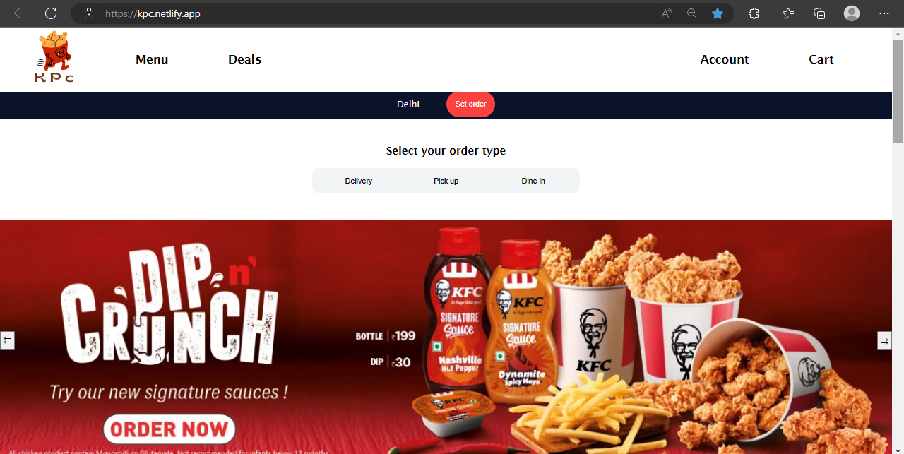

# tall-question-6900

https://kpc.netlify.app

KPC - Khao Piyo Chicken

Technologies: HTML | CSS | JS

Hello people! Thank you for visiting our project. 

KPC is a collaborative project build by four developers - [Shanuka](https://github.com/shanukajain), [Ranjan](https://github.com/Ranjan095), [Sudip](https://github.com/Sudip-C) and [Myself](https://github.com/rajeshuser). We have used HTML, CSS, and JS to build the project and completed it in 5 days. The project is responsive on all the pages and deployed using Netlify.

The objective of the project is to provide the user different kinds of chicken dishes which are generally not possible to cook at home in the todays hectic life.

The site has both user side and admin side.

User side: The site has 5 pages on user side that covers the entire user-flow.
1.	Home page: It showcases top dishes present on the site and provides routes to navigate to different parts of the site.
2.	Account page: Here user can sign-up, sign-in or sign-out to his account. If user is signed-in, he can see his order details and profile information on this page.
3.	Products page: The products page lists all the products available. It also provides searching and filtering features to narrow down the options. Any product can be added to cart or marked as favourite.
4.	Cart page: All the items added into the cart are shown here. User can increase or decrease the quantity of the products or remove from the cart.
5.	Checkout Page: It shows summary of the order and a form to fill payment card details. After successful purchase, products are removed from the cart and shifted to the order history.

Admin side: The site has 2 pages on admin side which allows to manage the stock and users data. 
1.	Products: It lists down all the types of products present in the database. Here admin can add new products, modify the existing one or even delete the products.
2.	Users: This page displays the existing users of the site. It allows the admin to give some offer to a user or control the access his account.

